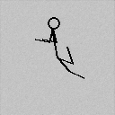

## Pose Guided Diffusion Animator

This repository contains the implementation of a Diffusion Denoising Probabilistic Model (DDPM) for generating stick figure animations, using Reinforcement Learning (RL) to guide the animation process. The RL agent is trained to optimize the stick figure's pose sequence to match the target image. The DDPM is then used to generate the stick figure animations. The final animation is saved as a GIF file. the project isnt complete yet, the animation is not good as expected. there needs tunning in the rl agent

## Installation

```bash
pip install -r requirements.txt
```

## Usage 
test the model by running the following commands, in sequence

```bash 
python -m src.common.dataset
python -m src.training.train_rl 
python -m src.training.train_diffusion
python -m src.animation.animate
```  
## Results 
the gif shows the animation of the stick figure, the animation is pretty restricted due to the RL agents current limitations in training 


